# Sistema de Controle de Carenagens

Sistema web desenvolvido para digitalizar, organizar e acompanhar o processo operacional de recebimento, conferência e entrada de carenagens.

O projeto foi desenvolvido com foco em organização, rastreabilidade, controle de etapas, gestão de usuários e redução de processos manuais.

---

## Sobre o projeto

O Sistema de Controle de Carenagens centraliza o fluxo de recebimento de peças, permitindo acompanhar cada etapa desde o registro da entrega até a realização da entrada.

A aplicação permite registrar entregas, realizar conferências físicas, anexar documentos fiscais, comparar informações da NF-e com o recebimento, registrar divergências e acompanhar todo o histórico do processo.

O sistema também possui controle de acesso por perfil de usuário, permitindo definir diferentes permissões para cada função.

---

## Principais funcionalidades

- Autenticação de usuários
- Controle de acesso por perfil
- Gestão de usuários e permissões
- Cadastro de novos usuários
- Alteração, ativação e desativação de usuários
- Troca de senha
- Cadastro de novas entregas
- Edição de entregas antes do recebimento
- Controle de recebimentos
- Salvamento automático durante o recebimento
- Conferência física das peças
- Registro de divergências
- Registro de avarias
- Controle de adequação da embalagem
- Cadastro de observações
- Consulta automática de referência e descrição das peças
- Integração com base de dados em Excel
- Anexação de NF-e
- Visualização da NF-e dentro do sistema
- Conferência da NF-e com o recebimento
- Aprovação da conferência
- Rejeição da conferência
- Registro do motivo da rejeição
- Substituição de NF-e quando necessário
- Confirmação da entrada
- Controle de status do recebimento
- Histórico completo das movimentações
- Linha do tempo de cada recebimento
- Registro dos responsáveis por cada etapa
- Registro de alterações realizadas nas referências e descrições
- Avisos de alterações pendentes para o administrador
- Dashboard com indicadores do período
- Consulta de pedidos e recebimentos
- Filtros por status
- Pesquisa por recibo, responsável ou NF-e
- Controle de notas fiscais
- Histórico de entradas realizadas

---

## Fluxo do processo

O processo operacional segue as seguintes etapas:

**Nova Entrega**

↓

**Recebimento**

↓

**Conferência Física**

↓

**Anexação da NF-e**

↓

**Conferência da NF-e**

↓

**Aprovação ou Rejeição**

### Se aprovado

**Entrada Realizada**

↓

**Finalização**

### Se rejeitado

**Retorno para correção / substituição da NF-e**

↓

**Nova conferência**

---

## Controle de acesso

O sistema possui diferentes perfis de usuário:

| Perfil | Acesso |
|---|---|
| Administrador | Acesso completo ao sistema |
| Operador | Recebimento e acompanhamento operacional |
| Conferente | Conferência de NF-e e documentos |
| Fornecedor | Cadastro de novas entregas |

As permissões podem ser configuradas individualmente de acordo com o perfil do usuário.

---

## Rastreabilidade

Cada recebimento possui um histórico próprio, permitindo acompanhar:

- Criação da entrega
- Responsável pelo recebimento
- Início do recebimento
- Conferência realizada pelo operador
- Alterações de referências e descrições
- Anexação da NF-e
- Conferência da NF-e
- Aprovação ou rejeição
- Motivo da rejeição
- Responsável pela conferência
- Realização da entrada
- Data e horário de cada etapa

Dessa forma, o processo pode ser acompanhado desde o início até sua finalização.

---

## Integração com Excel

O sistema utiliza uma base de dados em Excel como catálogo das peças.

A partir da referência informada, o sistema consulta a base e preenche automaticamente a descrição correspondente.

Essa integração reduz a necessidade de digitação manual e ajuda a manter a padronização das informações.

---

## Dashboard

O sistema possui um dashboard para acompanhamento das movimentações no período selecionado.

São apresentados indicadores como:

- Quantidade de carenagens pintadas
- Quantidade de recibos gerados
- Referências movimentadas
- Quantidades conferidas
- Período analisado

Também é possível consultar os dados agrupados por referência.

---

## Interface do sistema

### Início

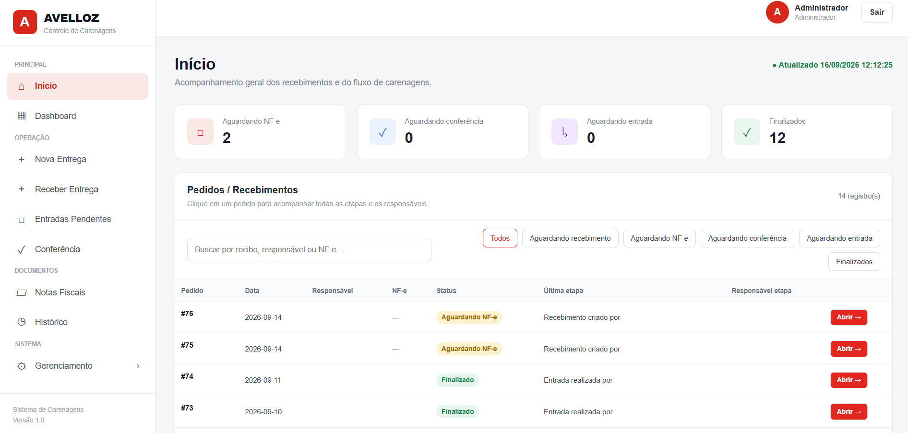

---

### Detalhes do Recebimento

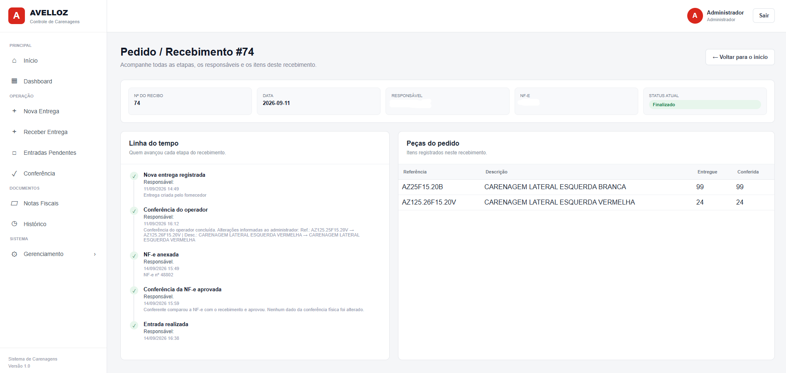

---

### Dashboard

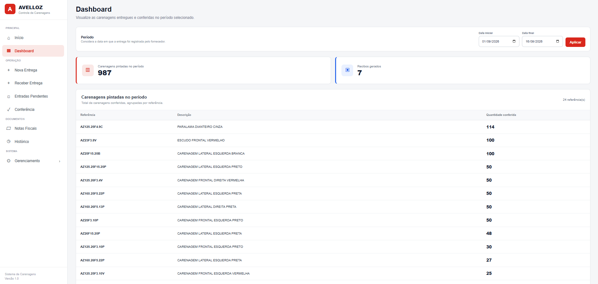

---

### Nova Entrega

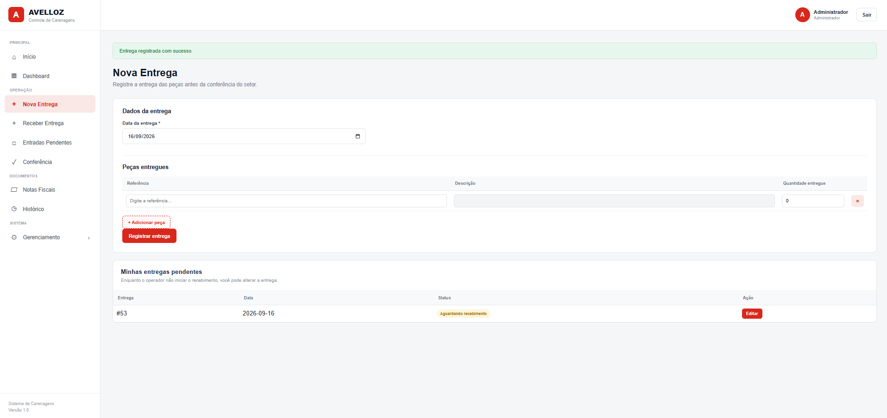

---

### Receber Entrega

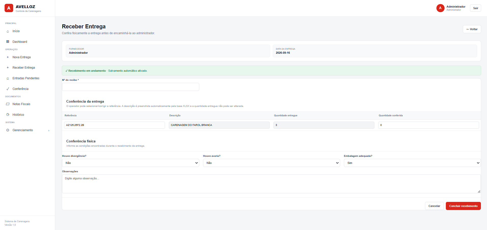

---

### Entrada do Recebimento

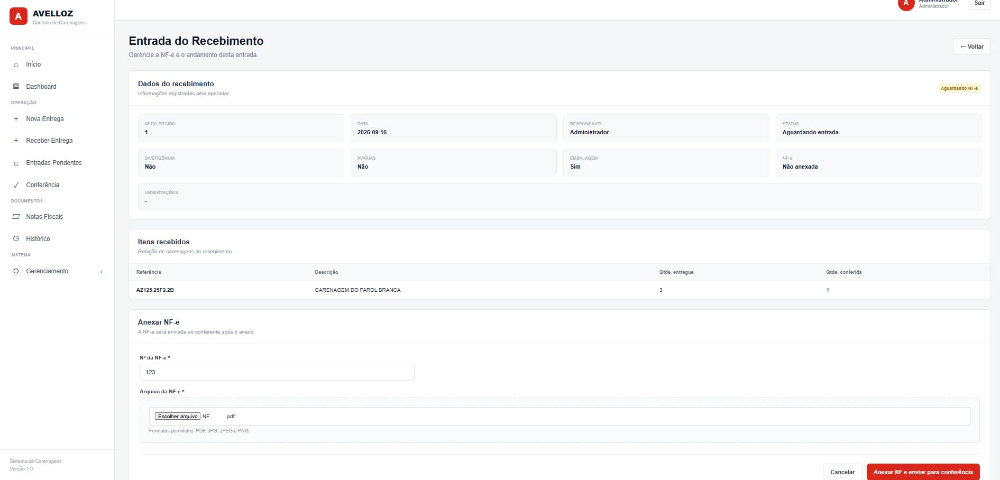

---

### Conferência

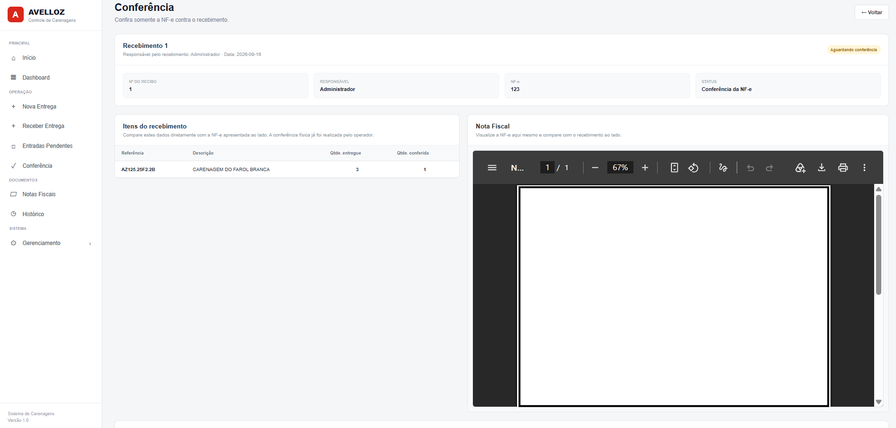

---

### Entrada Aprovada

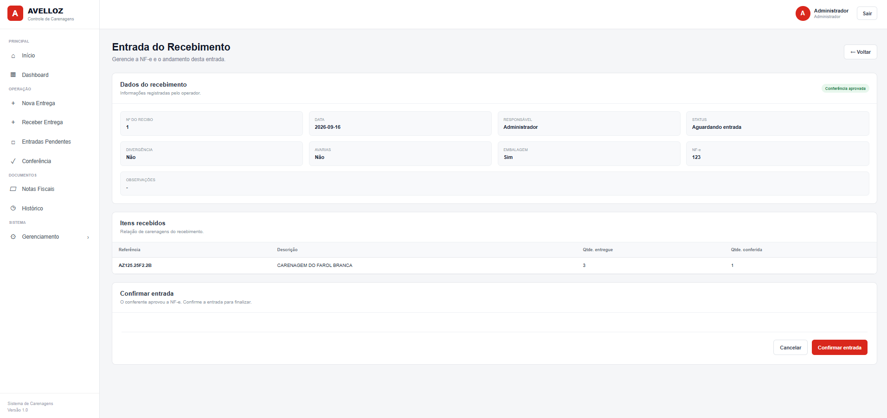

---

### Notas Fiscais

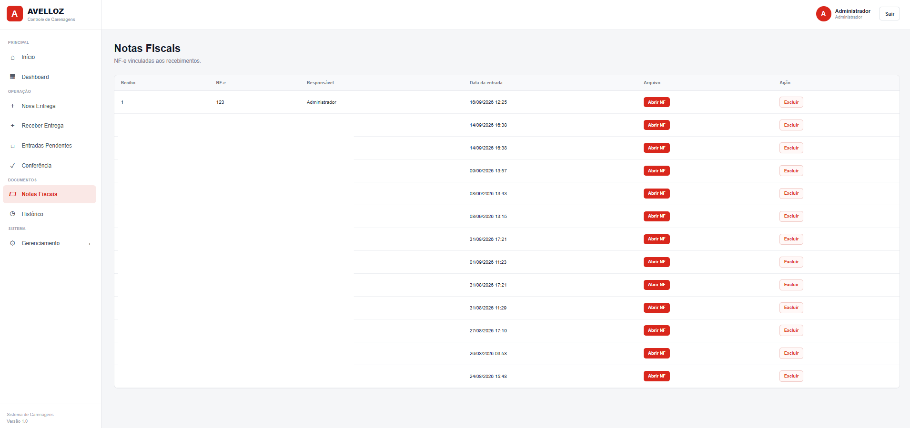

---

### Histórico

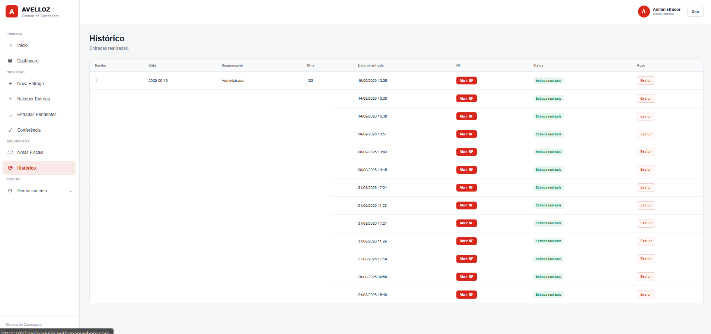

---

### Gerenciamento

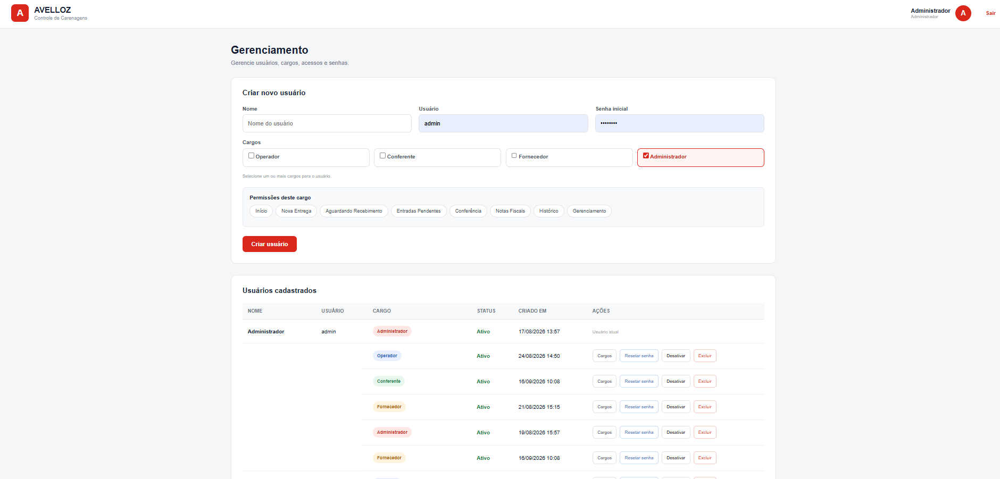

---

## Tecnologias utilizadas

### Linguagens

- Python
- HTML5
- CSS3
- JavaScript

### Tecnologias e ferramentas

- Flask
- SQLite
- OpenPyXL
- JSON

---

## Estrutura do projeto

```text
sistema-controle-carenagens/
│
├── app.py
├── carenagens.db
├── historico_fluxo.json
├── Base de Dados - Carenagens.xlsx
│
├── templates/
│   ├── login.html
│   ├── index.html
│   ├── nova_entrega.html
│   ├── recebimentos_operador.html
│   ├── gerenciamento.html
│   └── trocar_senha.html
│
├── nfes/
